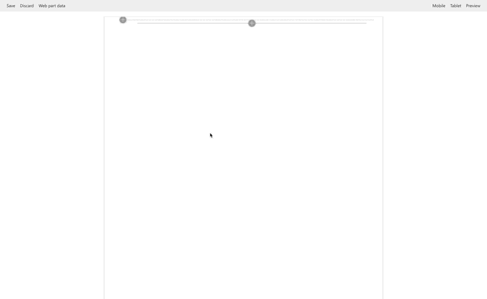

## Group People

### Summary

Display the members of a target SharePoint group. An alternative to display dynamically people without edit the page.

### Used SharePoint Framework Version

## Applies to

* [SharePoint Framework](https://dev.office.com/sharepoint)
* [Office 365 tenant](https://dev.office.com/sharepoint/docs/spfx/set-up-your-development-environment)

## Prerequisites
 
 * React 
 * PnP-JS-Core
 * React UI Fabric
 * SPFx Controls PlaceHolder

## Disclaimer

**THIS CODE IS PROVIDED *AS IS* WITHOUT WARRANTY OF ANY KIND, EITHER EXPRESS OR IMPLIED, INCLUDING ANY IMPLIED WARRANTIES OF FITNESS FOR A PARTICULAR PURPOSE, MERCHANTABILITY, OR NON-INFRINGEMENT.**

---

## Prerequisites

- SharePoint Online tenant with Office Graph content enabled

## Minimal Path to Awesome

* clone this repo
* in the command line run:
  * `npm i`
  * `gulp bundle --ship`
  * `gulp package-solution --ship`
* deploy the package to your app catalog
* approve the API permission request to access e-mails using Microsoft Graph
* add the web part to a page

## Features

This SharePoint Framework Web Part allow to:

- retrieving the SharePoint Groups from the current web
- retrieving users profiles properties
- passing Web Part properties to React components
- building dynamic web part properties
- managing the displayed title